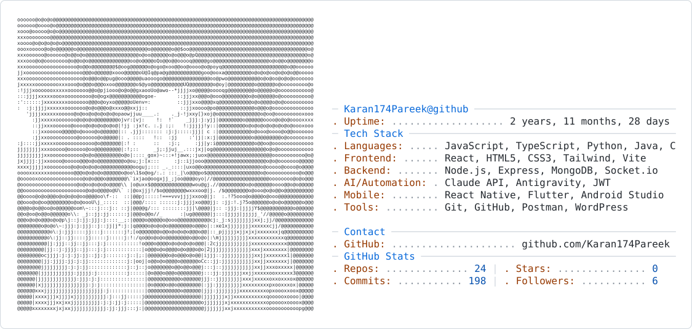

<picture>
  <source media="(prefers-color-scheme: dark)" srcset="assets/dark_mode.svg">
  <source media="(prefers-color-scheme: light)" srcset="assets/light_mode.svg">
  
</picture>

---

## About Me

I'm a Full Stack Developer (BCA, 2027) who co-founded **Ignitia Digital**, a web development and digital marketing agency, while still in university. My focus sits at the intersection of production web engineering and applied AI — I build systems that don't just ship features, but solve real operational problems for real businesses.

I care about end-to-end ownership: design, development, deployment, and the SEO/growth layer that makes a product findable once it's live.

**Open To:** Full Stack Developer Roles • Backend/Systems Engineering Internships • AI Tooling & Automation Projects • Freelance/Agency Collaboration

---

## Experience

**Co-Founder** — Ignitia Digital *Nov 2025 – Present*

Co-founded and operate a digital agency delivering full-stack web development and technical SEO for clients across e-commerce, immigration, and education verticals.

- Delivered 6+ client websites, achieving 3x organic traffic growth and 2x conversion rates
- Led end-to-end project execution for 4+ clients, architecting responsive web solutions
- Owns the full pipeline: design → development → deployment → SEO/growth

`React` `Node.js` `MongoDB` `SEO` `Client Management`

**Web Developer with SEO Intern** — Blue Minch *April 2025 – July 2025*

- Improved search rankings for 10+ client websites via keyword research, meta-tag optimization, and backlink management using SEMrush and Google Search Console
- Increased organic traffic through on-page and off-page SEO, tracked via Google Analytics
- Built and maintained responsive web pages using HTML, CSS, and JavaScript

`HTML` `CSS` `JavaScript` `SEMrush` `Google Analytics` `Technical SEO`

---

## Current Focus

```
current_focus:
  learning:
    - Advanced system design for hybrid cloud/local architectures
    - Deeper AI agent orchestration patterns
  building:
    - Ignitia Digital
    - ReconcileAI (Razorpay AI Buildathon 2026)
  exploring:
    - Multi-agent chaining pipelines
    - Applied LLM tooling for developer workflows
  open_to:
    - Full Stack Developer roles
    - Backend/Systems Engineering internships
    - AI automation collaborations
```

---

## Contribution Snake

[](https://raw.githubusercontent.com/Karan174Pareek/Karan174Pareek/output/github-contribution-grid-snake-dark.svg)

---

## Connect

[](mailto:karanpareek174@gmail.com)
[](https://www.linkedin.com/in/karanpareek/)
[](https://github.com/Karan174Pareek)
[](https://personal-portfolio-gamma-three-31.vercel.app/)

---

<div align="center">
<i>"Build the bridge between what exists and what should exist."</i>
</div>
